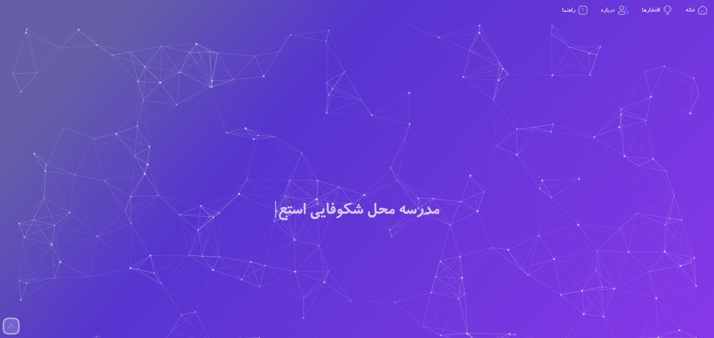

# School Web Template



## 📝 Description
A modern, responsive, and visually engaging school website template. This project features a professional purple-themed UI with interactive components, smooth animations, and a dedicated mobile-friendly navigation system.

## ✨ Features
- **Interactive Background:** Integrated `particles.js` for a dynamic and modern hero section.
- **Fully Responsive:** Optimized for all screen sizes, including a custom mobile sidebar menu.
- **Dynamic Typing Effect:** Uses `Typed.js` to create engaging welcome messages.
- **Informative Sections:** Includes "About Us," "Honors," "Educational Articles," and a contact section with a Google Maps integration.
- **Custom Typography:** Features beautiful Persian fonts (B-Koodak, B-Sepideh) for an authentic look.

## 🛠️ Technologies Used
- **HTML5 & CSS3:** Core structure and custom styling.
- **JavaScript (Vanilla):** For UI logic and menu interactions.
- **Bootstrap:** For responsive grid layout and components.
- **Particles.js & Typed.js:** For advanced visual effects.

## 🚀 How to Run
1. Clone the repository to your local machine:
```bash
git clone [https://github.com/EHSBIZ/School_Web.git](https://github.com/EHSBIZ/School_Web.git)
```
2. Simply open index.html in your favorite web browser to view the site.

## 📂 Project Structure

```index.html```: The main landing page.

```style.css```: Custom styles and color schemes.

```app.js``` & ```menu.js```: Logic for animations and mobile navigation.

```font```: Directory containing custom Persian typefaces.
